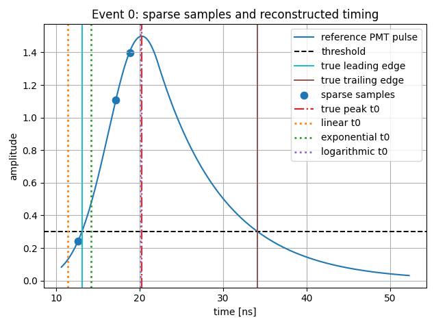
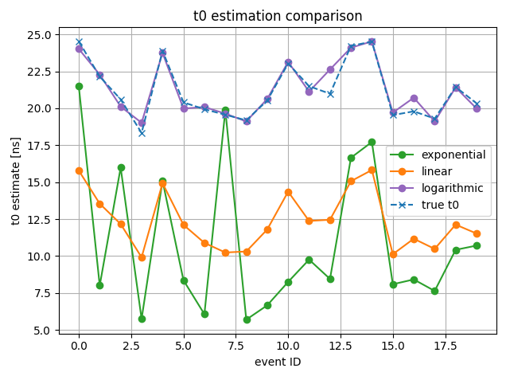
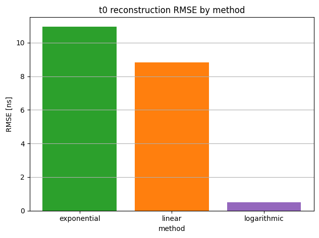
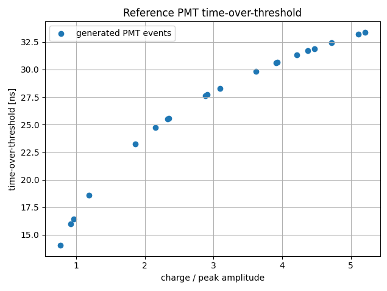

# Leading Edge Reconstruction from Sparse PMT Samples

Python reference model for a university FPGA project:

**Leading Edge Reconstruction from Sparse Samples**  
Target platform: **AMD/Xilinx Zynq UltraScale+ MPSoC ZCU106**  
Software environment: **Python / PYNQ / Vivado-oriented verification flow**

The project compares three sparse-sample reconstruction methods:

- **Linear interpolation**
- **Exponential interpolation**
- **Logarithmic / Gaussian-domain interpolation**

The Python model is intended to be used as a **golden reference** before implementing the selected algorithm in RTL and integrating it with AXI-Lite / AXI-Stream interfaces.

---

## 1. Project Structure

```text
leading_edge_python_model_v2/
├── main.py
├── requirements.txt
├── README.md
├── data/
│   └── example_samples.csv
├── tools/
│   └── generate_list_from_pmt.py
├── docs/
│   └── plots/
│       ├── sparse_samples_and_reconstructed_timing.png
│       ├── t0_estimation_comparison.png
│       ├── t0_reconstruction_RMSE_by_method.png
│       └── reference_PMT_time_over_threshold.png
└── src/
    └── leading_edge/
        ├── __init__.py
        ├── data.py
        ├── interpolation.py
        ├── metrics.py
        ├── models.py
        ├── plotting.py
        └── pmt_model.py
```

The Vivado project is located separately:

```text
Vivado/Leading_Edge_Reconstruction/
├── Leading_Edge_Reconstruction.xpr
├── Leading_Edge_Reconstruction.srcs/
│   ├── sources_1/
│   │   └── new/
│   │       ├── leading_edge_core.v
│   │       └── leading_edge_axi_lite.v
│   └── sim_1/
│       └── new/
│           └── TB_leading_edge.v
└── Leading_Edge_Reconstruction.gen/
```

---

## 2. Installation

Create and activate a virtual environment:

```bash
python3 -m venv venv
source venv/bin/activate
```

Install required packages:

```bash
pip install -r requirements.txt
```

Required Python libraries:

```text
numpy
pandas
matplotlib
```

---

## 3. Quick Start

Run the PMT synthetic source:

```bash
python main.py --source pmt
```

Run deterministic hardcoded list vectors:

```bash
python main.py --source list
```

Run CSV input:

```bash
python main.py --source csv --csv data/example_samples.csv
```

The program prints a result table and opens all plots at once.

---

## 4. PMT Model

The synthetic generator follows the PMT pulse-shape idea used in the PMT modeling article:

- Gaussian pulse component before the matching point,
- exponential tail after the matching point,
- discriminator threshold,
- leading-edge and trailing-edge timestamp estimation,
- time-over-threshold calculation.

The implemented reference pulse is:

```text
x = t - t_peak

V(t, q) = q * R_tilde * exp(-0.5 * (x / sigma)^2),     x <= x_match
V(t, q) = q * R_tilde / C * exp(-x / tau),             x >  x_match

x_match = sigma^2 / tau
C = exp(-0.5 * (sigma / tau)^2)
```

This keeps the Gaussian section and the exponential tail continuous in value and derivative at the matching point.

The default model parameters are intentionally simple and FPGA-friendly:

```text
sigma = 4.0 ns
tau = 8.0 ns
threshold = 0.3
R_tilde = 1.0
```

---

## 5. Random and Reproducible PMT Events

By default, PMT events are random:

```bash
python main.py --source pmt
```

The program prints the internally selected seed:

```text
Random PMT seed selected: 123456789
```

You can reuse that seed later to reproduce exactly the same event set.

To force a fixed seed:

```bash
python main.py --source pmt --seed 7
```

To generate more events:

```bash
python main.py --source pmt --events 50
```

To add more amplitude noise:

```bash
python main.py --source pmt --noise 0.05
```

Recommended workflow:

```bash
python main.py --source pmt --events 20 --seed 7 --noise 0.02
```

Use fixed seeds for Python-vs-FPGA comparisons and RTL testbench generation.

---

## 6. Generating CSV from the PMT Model

Generate a CSV file using a random PMT seed:

```bash
python main.py --source pmt --save-example-csv --csv data/example_samples.csv
```

Generate a reproducible CSV file:

```bash
python main.py --source pmt --save-example-csv --csv data/example_samples.csv --seed 7
```

Generate a larger CSV file:

```bash
python main.py --source pmt --save-example-csv --csv data/example_samples.csv --events 100 --seed 7
```

The CSV format is:

```text
event_id, t1, A1, t2, A2, t3, A3, true_t0, true_amax, sigma_ns, tau_ns, threshold, charge, true_t_leading, true_t_trailing, true_tot
```

Required columns for external data:

```text
event_id, t1, A1, t2, A2
```

Recommended columns:

```text
t3, A3, true_t0, true_amax, sigma_ns, tau_ns, threshold
```

When `sigma_ns`, `tau_ns`, and `threshold` are available, the plotted PMT reference curve is physically consistent with the input samples.

---

## 7. Generating Python List Vectors from the PMT Model

The project also contains a helper script:

```text
tools/generate_list_from_pmt.py
```

Run it with a fixed seed:

```bash
python tools/generate_list_from_pmt.py --events 5 --seed 7 --noise 0.0
```

Run it with a random seed:

```bash
python tools/generate_list_from_pmt.py --events 5
```

The script prints a ready-to-paste Python list:

```python
return [
    SampleEvent(...),
    SampleEvent(...),
]
```

Paste the printed output into the function:

```python
def get_list_events() -> list[SampleEvent]:
```

located in:

```text
src/leading_edge/data.py
```

This is useful when you want hardcoded, deterministic test vectors that can later be copied into an RTL testbench.

---

## 8. Reconstruction Methods

### Linear

The linear method uses two samples and extrapolates a simple straight-line model:

```text
t_cross = t1 - A1 * (t2 - t1) / (A2 - A1)
```

This is the cheapest method for FPGA implementation. It is useful as a baseline.

### Exponential

The exponential method uses three samples and estimates an exponential slope in the log-amplitude domain:

```text
tau_est = (t3 - t2) / ln(A3 / A2)
t_cross = t1 - tau_est * ln(A1 / threshold)
```

This method is included as an FPGA-relevant comparison because it requires a logarithm or LUT approximation.

### Logarithmic / Gaussian-Domain

The logarithmic method uses three samples and fits:

```text
ln(A) = c2*t^2 + c1*t + c0
```

For a Gaussian rising edge, this is a physically meaningful transformation. The pulse peak estimate is the vertex of the fitted parabola:

```text
t0 = -c1 / (2*c2)
```

The amplitude estimate is:

```text
Amax = exp(ln(A(t0)))
```

This is the most consistent method for the Gaussian leading edge.

---

## 9. Plotting

The program opens all plots simultaneously:

1. Sparse samples and reconstructed `t0` for selected events.
2. Method comparison over all events.
3. RMSE comparison.
4. Time-over-threshold comparison when reference PMT values are available.

The first event plots use explicit colors for reconstructed markers:

```text
linear       -> red
exponential  -> green
logarithmic  -> purple
```

### Sparse samples and reconstructed t0 for selected events


This plot presents selected PMT events together with their sparse input samples and reconstructed timing points.

### Method comparison over all events


This plot compares the estimated t0 values obtained by different reconstruction methods over the complete set of generated or loaded events.

### RMSE comparison


This plot presents the RMSE value for each reconstruction method.

```text
RMSE = sqrt(mean((t0_estimated - t0_reference)^2))
```

### Time-over-threshold comparison


This plot shows the reference PMT time-over-threshold behavior when reference PMT values are available.

---

## 10. RTL Implementation (Vivado)

### Fixed-Point Format

All RTL signals use **Q16.16** fixed-point format:

```text
integer_value = real_value * 65536
```

Example: 18.284 ns → `0x00124849`

### Module Overview

| Module | Description |
|--------|-------------|
| `leading_edge_core.v` | Computational engine, 6-stage pipeline, all three methods |
| `leading_edge_axi_lite.v` | AXI4-Lite wrapper (Phase 1), register-based access from ARM |
| `leading_edge_axis.v` | AXI4-Stream wrapper (Phase 2), DMA-based pipelined operation |
| `TB_leading_edge.v` | Behavioral testbench, 15 test cases (5 events × 3 methods) |

### Register Map (AXI-Lite)

| Offset | Name | R/W | Description |
|--------|------|-----|-------------|
| 0x00 | CTRL | W | `[0]`=start, `[2:1]`=mode_sel (00=lin, 01=exp, 10=log) |
| 0x04 | STATUS | R | `[0]`=done, `[1]`=valid, `[2]`=overflow |
| 0x08 | T1 | W | Time sample 1 [ns], Q16.16 |
| 0x0C | A1 | W | Amplitude sample 1, Q16.16 |
| 0x10 | T2 | W | Time sample 2 [ns], Q16.16 |
| 0x14 | A2 | W | Amplitude sample 2, Q16.16 |
| 0x18 | T3 | W | Time sample 3 [ns], Q16.16 (optional) |
| 0x1C | A3 | W | Amplitude sample 3, Q16.16 (optional) |
| 0x20 | THRESH | W | Discriminator threshold, Q16.16 |
| 0x24 | T0_EST | R | Reconstructed t0 [ns], Q16.16 |
| 0x28 | AMAX_EST | R | Estimated peak amplitude, Q16.16 |
| 0x2C | EVENT_ID | R | Event identifier (read-only) |

### Simulation Results

After loading the RTL files into Vivado and running behavioral simulation:

```text
=== Leading Edge Reconstruction - FPGA vs Python (64-seg LUT) ===
 Ev Mode   FPGA[ns]    Ref[ns]  Err[ns] Result
-------------------------------------------------------------------
 0   LIN    12.1617    12.1617   0.0000  PASS
 0   EXP     4.5033     4.5033   0.0000  PASS
 0   LOG    18.2697    18.2697   0.0000  PASS
 ...
WYNIK: 15 PASS,  0 FAIL  (na 15 testow)
```

Tolerances applied: LIN = 0.10 ns, EXP = 0.55 ns, LOG = 0.15 ns.

### Block Design (Phase 1, AXI-Lite)

The Block Design connects the following IPs:

```text
Zynq UltraScale+ MPSoC  →  AXI Interconnect (1S/1M)  →  leading_edge_axi_lite_0
```

After connecting, run Validate Design (0 errors expected), assign addresses, generate bitstream and export hardware as `leading_edge.xsa`.

---

## 11. PYNQ Access

Load the overlay and access the coprocessor from a Jupyter notebook:

```python
from pynq import Overlay

ol = Overlay("leading_edge.xsa")
ip = ol.leading_edge_axi_lite_0

SCALE = 65536

def q16(v):  return int(round(v * SCALE)) & 0xFFFFFFFF
def fq16(v):
    s = int(v) & 0xFFFFFFFF
    if s & 0x80000000: s -= 0x100000000
    return s / SCALE

ip.write(0x20, q16(0.3))       # threshold
ip.write(0x08, q16(13.44))     # t1
ip.write(0x0C, q16(1.25))      # a1
ip.write(0x10, q16(15.90))     # t2
ip.write(0x14, q16(3.65))      # a2
ip.write(0x18, q16(18.01))     # t3
ip.write(0x1C, q16(5.07))      # a3

ip.write(0x00, (2 << 1) | 1)   # start, mode=logarithmic

while not (ip.read(0x04) & 1):
    pass

print(f"t0 = {fq16(ip.read(0x24)):.4f} ns")
```

---

## 12. Typical Development Flow

1. Generate PMT events in Python.
2. Run all interpolation methods.
3. Compare reconstruction error and RMSE.
4. Export CSV or hardcoded list vectors.
5. Use the same vectors in RTL testbench.
6. Compare Python golden model with FPGA output.
7. Measure performance for ARM / AXI-Lite sequential / AXI-Stream pipelined versions.

---

## 13. Notes

This model is not a complete detector simulation. It intentionally focuses on the pulse-shape and sparse-sample reconstruction problem needed for FPGA implementation.

Not included in this version:

- full PMT charge distribution,
- underamplification model,
- thresholdband model,
- saturation at very high charge,
- full statistical time-over-threshold distribution fitting.