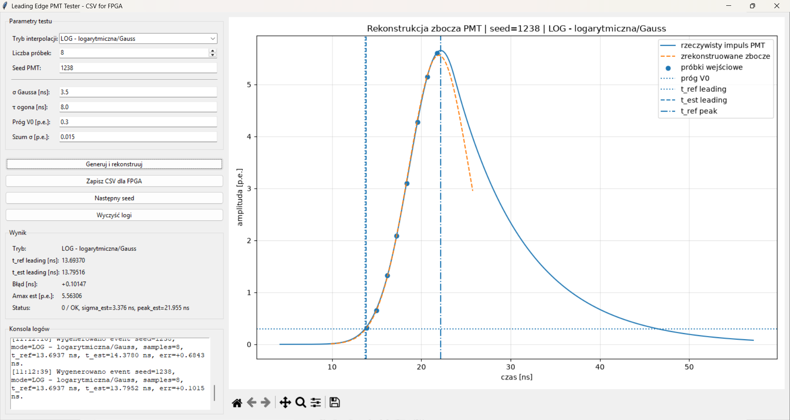

# Leading Edge PMT Tester

A simple desktop application for generating a PMT pulse, reconstructing its leading edge from sparse samples, and exporting CSV data for the FPGA.



## Running with Python

```bash
pip install -r requirements.txt
python leading_edge_gui.py
```

## Building the `.exe` File on Windows

Double-click `build_exe.bat` or run:

```bat
build_exe.bat
```

The resulting file will be located in:

```text
dist\LeadingEdgeTester.exe
```

## CSV Format

The **Save CSV for FPGA** button saves a file compatible with the previous `example_samples.csv` generator.

The column order is exactly the same:

```text
event_id,t1,A1,t2,A2,t3,A3,true_t0,true_amax,sigma_ns,tau_ns,threshold,charge,true_t_leading,true_t_trailing,true_tot
```

Field descriptions:

- `t1,A1,t2,A2,t3,A3` — three sample pairs used by the model or FPGA,
    
- `true_t0` — reference time of the PMT pulse maximum,
    
- `true_amax` and `charge` — reference pulse amplitude,
    
- `sigma_ns`, `tau_ns`, `threshold` — PMT model parameters,
    
- `true_t_leading`, `true_t_trailing`, `true_tot` — reference threshold-crossing and time-over-threshold values.
    

When more than three samples are selected in the GUI, the legacy export saves three representative samples: the first, middle, and last samples. When two samples are selected, the `t3,A3` columns are filled with zeros to maintain compatibility with the CSV header.