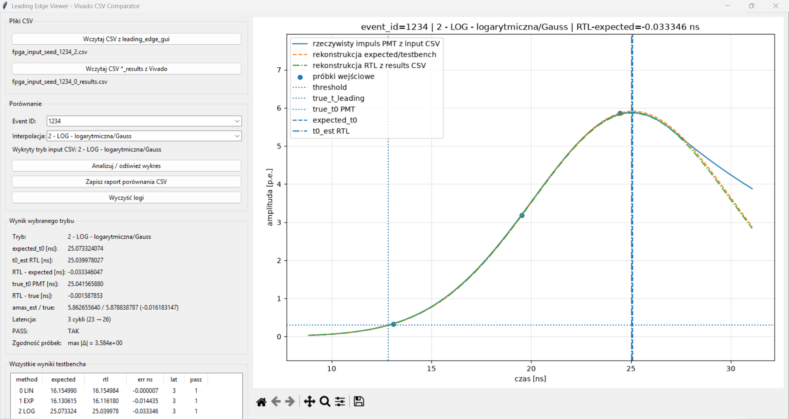

# Leading Edge Viewer

A desktop application for displaying and comparing results from:

1. a CSV file generated by `leading_edge_gui`,
2. a results file generated by the Vivado testbench.



The application displays the actual PMT pulse, input samples, reference reconstruction, and the RTL result obtained from the testbench. It also calculates the timing differences between `expected_t0`, `t0_est`, and `true_t0`.

## Supported CSV Formats

### Input CSV from `leading_edge_gui`

Required header:

```csv
event_id,t1,A1,t2,A2,t3,A3,true_t0,true_amax,sigma_ns,tau_ns,threshold,charge,true_t_leading,true_t_trailing,true_tot
```

### Results CSV from the Vivado Testbench

Required header:

```csv
event_id,method_id,t1,A1,t2,A2,t3,A3,threshold,true_t0,expected_t0,t0_est,amax_est,error_vs_expected_ns,error_vs_true_ns,start_cycle,valid_cycle,latency_cycles,t0_raw,amax_raw,pass
```

The `method_id` field represents:

- `0` — linear,
    
- `1` — exponential,
    
- `2` — logarithmic / Gaussian.
    

## Running with Python

```bat
python leading_edge_viewer.py
```

## Building the EXE File on Windows

Run:

```bat
build_exe.bat
```

After the build process is complete, the executable should be available at:

```text
dist\LeadingEdgeViewer.exe
```

## Note About the RTL Plot

The `*_results.csv` file stores the scalar values `t0_est` and `amax_est`, rather than the complete set of RTL curve coefficients. Therefore, the RTL plot displayed by the viewer is a visualization.

The application takes the reference curve reconstructed from the input samples, shifts it by `t0_est - expected_t0`, and scales its amplitude to match `amax_est`.

The values displayed in the comparison panel are calculated directly from the data stored in the CSV file.